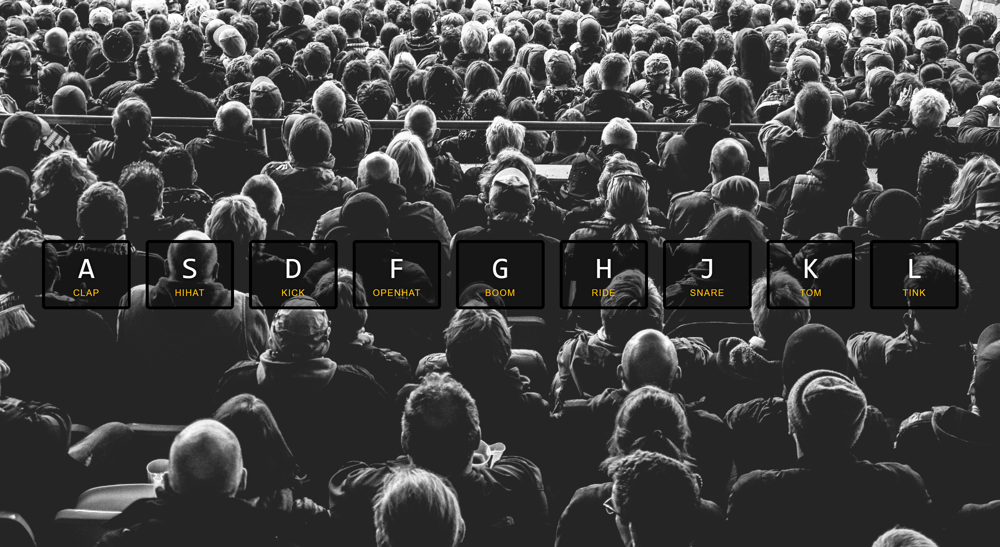

# JavaScript Drum Kit

A simple web application that allows you to play drum sounds by pressing keys on your keyboard.



JavaScript Drum Kit.png
## Table of Contents
- [Demo](#demo)
- [Technologies Used](#technologies-used)
- [Features](#features)
- [How to Use](#how-to-use)
- [Contributing](#contributing)
- [License](#license)

## Demo

You can try the live demo [here](link-to-your-live-demo).

## Technologies Used

- HTML5
- CSS
- JavaScript (ES6)

## Features

- Keyboard Interaction: Play drum sounds effortlessly by pressing the keys 'A', 'S', 'D', 'F', 'G', 'H', 'J', 'K', or 'L' on your keyboard.

- Visual Feedback: Experience responsive visual feedback as the pressed key is displayed on the screen with a subtle animation effect, enhancing the user experience.

- Intuitive UI: Interact with an intuitive user interface that simplifies drumming, making it accessible to users of all skill levels.

- Sound Library: Enjoy a carefully curated collection of high-quality drum sounds that provide an authentic drumming experience.

- Customizable: Easily customize the drum kit by replacing the default sounds with your preferred drum samples, giving you creative freedom.

## How to Use

1. Clone the repository:

   ```sh
   git clone https://github.com/your-username/js-drum-kit.git

## Contribution

Contributions are welcome! If you would like to contribute to this project, please follow these steps:

1. Fork the repository.
2. Create a new branch for your feature or bug fix.
3. Make your changes and commit them.
4. Push your changes to your fork.
5. Submit a pull request.

Please make sure to follow the [code of conduct](CODE_OF_CONDUCT.md).

## License

This project is licensed under the MIT License - see the [LICENSE.md](LICENSE.md) file for details.

